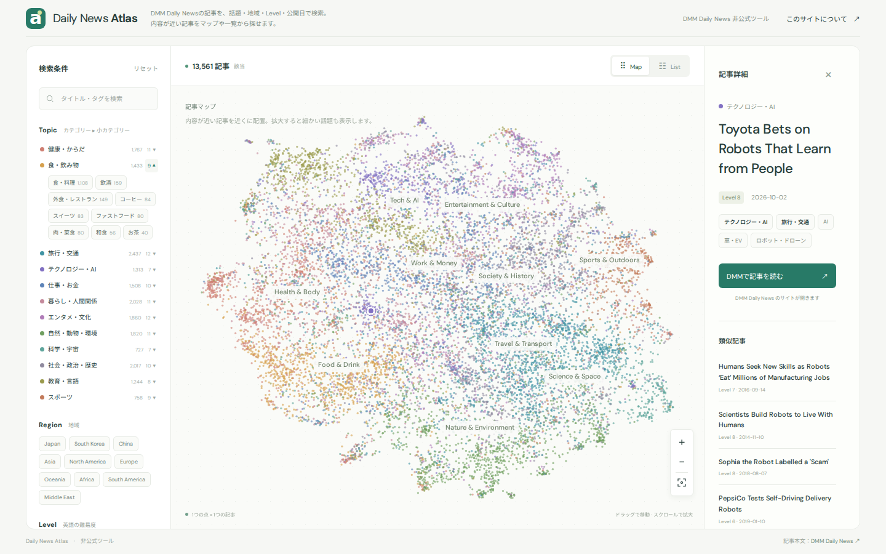

# Daily News Atlas

**DMM英会話 Daily Newsの記事を、話題の地図から選べる非公式ツールです。**

「今日のレッスンは何について話そう？」と迷ったときに、1万3千件以上の記事を眺めて、話してみたい話題を見つけられます。

**👉 https://nakanishi1337.github.io/daily-news-atlas/**



## このサイトを作った理由

DMM英会話を半年ほど、ほぼ毎日受講していました。Daily Newsはとても良い教材で、毎日のように新しい記事が公開されるので、日々新しい話題を楽しめました。

ただ、新着の中に「これについて話したい」と思える記事がない日は、記事選びに時間がかかってしまうのが悩みでした。

一方で、Daily Newsにはこれまでに1万件以上の記事が公開されていて、古い記事でも教材として十分に使えます。新着だけでなく、過去の記事からも話したい話題を気軽に選べるように、このサイトを作りました。

## できること

- **記事マップで眺める** — 1つの点が1つの記事です。内容が近い記事ほど近くに集まり、色は話題のカテゴリーを表します。拡大すると「睡眠」「鉄道」などの細かい話題名が現れます
- **話題から選ぶ** — 健康・からだ、食・飲み物、旅行・交通、エンタメ・文化など12のカテゴリーと、その中の睡眠、和食、空の旅、アニメ・漫画、野球など117の話題から選べます
- **条件で絞り込む** — 地域（Japan、Europeなど）、Level（4〜9）、公開日でも絞り込めます。キーワード検索は英語のタイトルにも、日本語の話題名（例：「和食」）にも対応しています
- **似た記事と比べる** — 記事を選ぶと、内容の近い記事が6件表示されます。同じ話題で難易度や時期の違う記事を比べられます
- **DMMで読む** — 記事詳細のボタンから、DMM英会話の記事ページを開けます
- **共有する** — 絞り込み条件や選んだ記事はURLに保存されるので、そのままブックマークや共有ができます

スマートフォンでも使えます。

## 使い方の例

1. 左の **Topic** から気になるカテゴリーの ▾ を開き、話題を選ぶ（例：食・飲み物 → 和食）
2. **Level** で自分のレベルに合わせて絞り込む
3. マップの点か、**List** 表示の記事を選んで、タイトルと類似記事を見比べる
4. 話したい記事が決まったら **DMMで記事を読む** から開く

## 収録データ

- 2014年4月以降のDaily News全記事（13,000件以上）の、タイトル・Level・公開日・URL
- **毎週月曜の朝に新着記事を自動で追加**しています
- 記事本文は収録していません。本文はDMM英会話のサイトで読めます

## ご注意

- DMM英会話とは提携していない、個人の非公式ツールです
- 話題やカテゴリー、マップ上の位置は**記事タイトルだけから自動で推定**しています。分類の誤りや付け漏れがあります
- 自動更新で追加された記事は、似ている既存記事の近くに配置されます

---

## 開発者向け

<details>
<summary>ローカルでの起動・データ生成・自動更新・テスト</summary>

### ローカルで起動

```bash
npm run dev   # http://localhost:5173
```

Python 3だけで動きます（npm依存は不要）。JSONを読み込むため、HTMLを直接開かずHTTPサーバー経由で開いてください。フロントエンドはフレームワークなしのHTML / CSS / JSで、マップはCanvasで描画します。

### 構成

```text
collect_daily_news.py       一覧ページからタイトル・Level・公開日・URLを収集（本文にはアクセスしない）
daily_news_articles.json    収集した記事メタデータ
scripts/build_map.py        embedding → タグ推定 → 地図座標 → 類似記事 → site/data/articles.json
scripts/build.mjs           データの検証と dist/ へのコピー
site/                       公開する静的サイト
.github/workflows/          毎週の更新とGitHub Pagesへの公開
tests/                      Pythonの単体テストとPlaywrightのブラウザテスト
```

### 仕組み

- 記事タイトルを [Sentence Transformers](https://www.sbert.net/) の `all-MiniLM-L6-v2` で384次元のembeddingに変換（CPUで動作、外部APIやAPIキーは不要）
- 地図はUMAP（cosine距離、n_neighbors=30、min_dist=0.16、random_state=42）で2次元に配置
- 類似記事は2次元上の距離ではなく、元のembeddingで近い6記事
- 話題（小カテゴリー117個）のうち、広い分野25個（旅行、健康・医療など）はタイトルと説明文のembedding類似度で、残り92個（睡眠、和食、鉄道など）はタイトルのキーワード規則で付与。大カテゴリーは付与された話題の親から決まります
- 地域はタイトルのキーワード規則で付与
- 規則は `scripts/build_map.py` の `CATEGORIES`、`TOPICS`、`SPECIFIC_TOPICS`、`EXCLUSIONS`、`REGIONS` で編集できます

### データ生成

Python 3.12で検証しています。

```bash
python3 -m venv .venv
.venv/bin/pip install -r requirements.lock.txt --extra-index-url https://download.pytorch.org/whl/cpu
.venv/bin/python scripts/build_map.py                # 全体ビルド（地図を再計算。点の位置が変わる）
.venv/bin/python scripts/build_map.py --incremental  # 新着だけを似た記事の近くに追加（既存の点は動かない）
.venv/bin/python scripts/build_map.py --retag-only   # タグ規則の変更だけを反映（座標・類似記事は維持）
```

小規模に試す場合は `--limit 100 --output /tmp/atlas-sample.json`。`.cache/` にembeddingをキャッシュします。

### 新着の取得

```bash
python3 collect_daily_news.py --all-pages --max-pages 3 --delay 1 --pretty \
  --merge daily_news_articles.json --output daily_news_articles.json
```

1ページ54記事です。取得結果が0件の場合は既存ファイルを変更せず失敗します。サイトに負荷をかけないよう、間隔を空けて実行してください。

### 自動更新と公開（GitHub Actions）

`.github/workflows/update-site.yml` が毎週月曜 06:00 JST に、新着の取得 → `--incremental` → テスト・検証 → データのコミット → GitHub Pagesへの公開を行います。新着がなければコミットしません。`site/` を変更して main にpushした場合も公開されます。

Actions → "Update articles and deploy" → Run workflow から手動でも実行できます。

- `max_pages`：取得ページ数（更新が1か月以上止まっていた場合に増やす）
- `full_rebuild`：地図全体を再計算する。新しいテーマの記事が大量に増えたときなどに、ときどき実行してください

`site/data/articles.json` の `meta.layoutBuiltAt` に地図を最後に計算した日時、`meta.placedSinceLayout` にその後追加した記事数を記録しています。

### テスト

```bash
python3 -m unittest discover -s tests -p 'test_*.py'
npm ci && npx playwright install chromium && npm test
```

</details>
